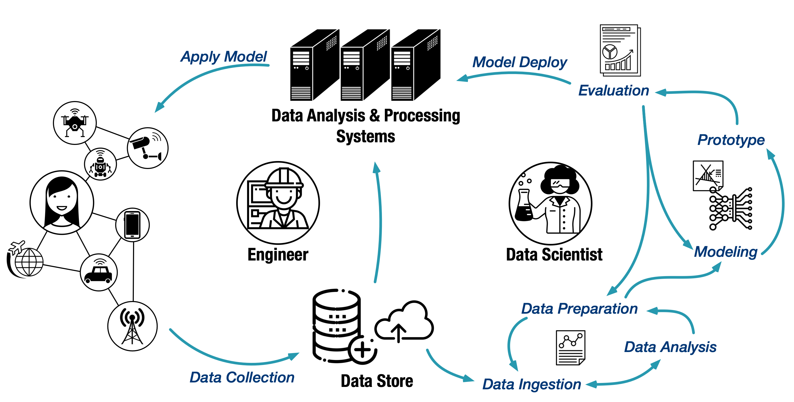
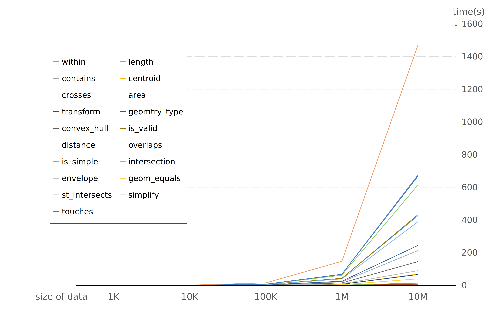
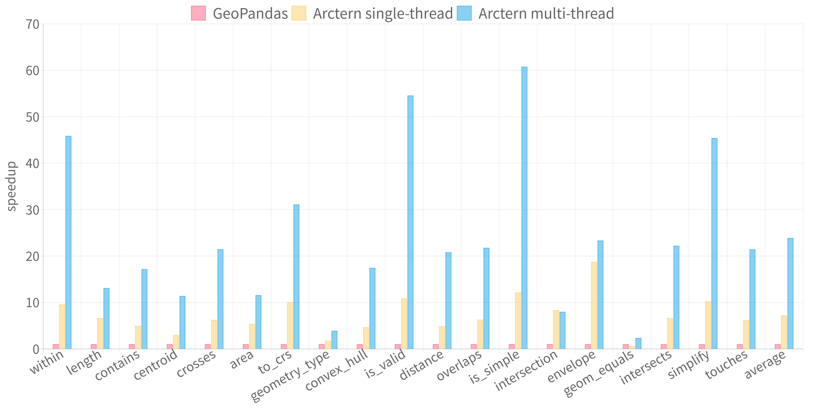

# The missing piece towards 'any scale' spatial-temporal analytics

Internet of Things (IoT) and 5G technologies will involve an astounding amount of data recording the links between people, device, event, location, and time. According to IDC's forecast, there will be 79.4 zettabytes of data generated by 41.6 billion IoT devices in 2025. With the rapid growth of IoT data and IoT applications, there is an ever rising demand for a highly efficient spatial-temporal data science workflow to gain insights from the overwhelming data.

Scalability is key to building productive data science pipelines. To address this scalability challenge, we launched Arctern, an open source spatial-temporal analytic framework for boosting end-to-end data science performance. Arctern aims to improve scalability from two aspects: 1. Unified data analytic and processing interface across different platforms, from laptops to clusters and cloud; 2. Rich and consistent algorithms and models, including trajectory processing, spatial clustering and regression, etc., across different data science pipeline stages. 

The rest of this article probes into the current geospatial data science pipelines and reviews the tools, libraries, and systems used in each stage. By discussing the existing workflows' deficiencies, we underscore the importance of scalability. We will show that well-scaled interfaces, algorithms, and models not only reduce the time to solve mathematical or technical problems, but also improve the efficiency of collaboration and communication between data scientists and engineers. 

### A brief review of spatial-temporal data science workflows

To better understand the scalability problem existing in the current workflows, we need to take a look at the pipeline of spatial-temporal data science, which is illustrated in the figure above. Raw data is first generated by IoT devices, and then collected by data store. Data scientists make exploratory analysis over these data. Basing on technical hypothesis and data features, they select proper models to develop a prototype for answering business questions. After a few iterations of evaluation and adjustment, the model will finally be deployed on a data processing system, which in turn delivers better services to end users via IoT devices.

The whole process can break down to three stages:

* *Prototype development*. In this stage, data scientists tend to work with small datasets for the purpose of fast data exploration, efficient model selection, and iterative prototype polishing. Lightweight tools are favored in this stage, because they can provide quick insights and support fast iteration. Typical tools include NumPy, GeoPandas, scikit-learn, PySAL, and kepler.gl.
* *Model evaluation*. To fit the prototype into the production environment, much larger (or even close to production level) datasets are used for model evaluation. As a result, the model evaluation-modification iterations in this stage are much less agile than in the prototype stage. Moreover, the tool chain is much heavier. Most of the commonly-used tools, such as PostGIS and PySpark, are disk-based, or distributed.
* *Model deployment*. Deployment is the stage where the model is integrated into the existing production environment to provide practical services. This stage involves large-scale systems such as HDFS, Hbase, TSDB for storage, and Spark, Flink, GeoMesa for data processing.

### The scalability problems

At different stages of spatial-temporal data science, demand for tool chain varies significantly. Although libraries and systems mentioned above can jointly support the overall data science workflow, an individual tool can hardly scale across multiple data science stages or across different analytic platforms (laptop, cluster, or cloud). As a result, the tool chain grows increasingly complex to a point where it is hard to streamline the workflow. Specifically speaking, the challenges are three-fold:

* *The gap between library (system) interfaces*. Libraries or systems used in different stages do not share a unified interface. As a consequence, data scientists may use multiple languages such as Python, R, Scala, SQL and inconsistent function names throughout the process of data analysis, prototype development, model evaluation, and model deployment. Such interface inconsistency significantly steepens the learning curve, and forces data scientists to spend valuable time and brainpower rewriting their codes, rather than focusing on business questions.
* *The gap between algorithm/model libraries*. Libraries used in different stages have different support for algorithms and models. At present, the agreement of standardization is still on the level of primitives, as the ones proposed by the Open Geospatial Consortium (OGC). This significantly reduces productivity. When an advanced algorithm is used as part of the solution during prototype development, but no proper implementation is found for the production environment, great efforts have to be taken to reinvent the wheel.
* *The gap between data scientist and engineer*. Spatial-temporal data science deals with mathematical problems, technical problems, and business problems. It calls for seamless collaboration between data scientists and engineers. However, the inconsistency of the tools used throughout the workflow makes collaboration difficult. Given that different programming languages and algorithm implementations are used in different data science stages, the engineers may have no idea as to what models the data scientists used, whilst the data scientists are struggling to understand why the engineers cannot make their models work.

In the next few sections, we will compare several libraries and systems widely used in spatial-temporal data science, and give more discussion on the missing piece towards 'any scale' spatial-temporal analytics. 

### Popular tools and their limitations

As Python is becoming the primary solution for geospatial data processing and analysis, data scientists have developed a vocabulary based on a tool set including NumPy, Pandas, Shapely, GeoPandas, PySAL, etc. With these tools, they can fully express their thoughts and follow an idea to its conclusion.

Shapely is a Python package providing primitives such as geometric data construction, common geometric operations, relationship analysis and coordinate system projection. GeoPandas combines the capabilities of Pandas and Shapely to ease geospatial data processing in python. It organizes geospatial data as GeoSeries or GeoDataFrames and provides operations to construct, analyze, and manipulate multiple geometries. 

PySAL is a Python spatial analysis library that provides modules for higher-level analysis on geospatial data. Its functionality includes spatial data exploratory analysis like statistical testing on points, polygonal lattices as well as advanced spatial analysis, such as spatial clustering and spatial regression. 

Despite their popularity, these tools cannot scale to crunch big data. They were inherently designed for small datasets on a standalone machine. Considering the capacity of modern laptops and workstations, the size of data that these tools can handle would be up to a couple of GBs. The figure below shows the performance of 19 frequently-used primitives in GeoPandas. As we can observe, when data size reaches 10M, most of the primitives in GeoPandas take several minutes to complete. PySAL shares the same problem with GeoPandas when handling large datasets. Compared with the primitives in GeoPandas, the advanced algorithms in PySAL generally have higher computation complexity, thus may cause even severer efficiency problems on data analysis and prototype development. Since data scientists need to iteratively adjust and verify their models until they get satisfying results, these primitives and algorithms are frequently and repeatedly used. The scalability problem would seriously degrade efficiency in the spatial data science workflow. 

Due to the scalability problem, the above-mentioned tools are generally used in prototype design with small datasets. To work with large production-level datasets, data scientists and engineers would eventually need to migrate their algorithms to distributed solutions, such as GeoSpark and GeoMesa.

GeoSpark is a cluster computing system that extends Apache Spark and SparkSQL with a set of Spatial Resilient Distributed Datasets and SpatialSQL functions that efficiently load, process, and analyze large-scale spatial data across machines. GeoMesa enables large-scale geospatial query and analytics on distributed computing systems, including spatial-temporal indexing, stream processing, and custom distributed analytics.

| Project | Data Interface | Programming Language |
| --- | --- | --- |
| GeoPandas | GeoDataFrame | python |
| CuSpatial | cuDF | python, C++ |
| PostGIS | Table | PostgreSQL |
| GeoSpark | GeoSpark Spatial RDD | SparkSQL, java, scala |
| GeoMesa Spark | GeoMesa Spatial RDD | SparkSQL, java, scala |

Compared with GeoPandas and PySAL, GeoSpark and GeoMesa adopt very different API abstraction. The Table above presents an interface comparison. The data interfaces vary greatly among different tools, with no pair of tools sharing identical data interface. In terms of programming language, there are three major categories: python, SQL, and Java/Scala. 

| Project | # OGC standard primitives | Advanced models and algorithms |
| --- | --- | --- |
| GeoPandas | 33 | spatial join, etc. |
| PySAL | - | clustering, regression, correlated variance analysis, etc. |
| CuSpatial | - | point-in-polygon, trajectory, etc. |
| PostGIS | 312 | spatial join, etc. |
| GeoSpark | 37 | spatial join, etc. |
| GeoMesa Spark | 75 | spatial join, KNN search, proximity search, route search, tube selection, etc. |

The table above compares the provided primitives and algorithms among geospatial analysis tools. The number of supported OGC standard primitives shows large difference, ranging from around 30 to three hundred. The advanced algorithms show great divergence as well. Each of the tools offers a limited set of algorithms that hardly overlap.

Due to the significant inconsistency in data interface, programming language, algorithm, and model, whenever applying a model prototype to large production datasets, engineers may have to rewrite the entire data processing logic. For advanced analysis such as spatial clustering and regression, data scientists may have to re-implement models and algorithms from scratch.

### Arctern's approach and current progress

In Arctern, to help data scientists and engineers improve productivity and creativity, we try to fix the inconsistency problem of spatial data science tools by providing rich primitives, algorithms, and models with consistent interfaces across laptop, cluster and cloud environments. 

Among the tools we studied, we found that GeoPandas has interfaces working best with the usage habits of data scientist and is easy to use. Therefore, we adopt its idea and plan to build the GeoDataFrame/GeoSeries that scale both up and out. On top of this, we will develop a consistent spatial-temporal algorithm set across execution environments.

We have now developed an efficient multi-thread GeoSeries implementation, and the distributed version is in progress. In the latest version 0.2.0, Arctern achieves 24x speed up against GeoPandas. Even under single-thread execution, Arctern outperforms GeoPandas 7x on average. The detailed evaluation results are illustrated in the figure below.

In terms of interaction/exploration on large datasets, Arctern provides rendering methods that can render data (as heatmap, choropleth, etc.) with a volume of 10M in seconds. 

We are also conducting experimental GPU acceleration for spatial-temporal data analysis and rendering. By now Arctern provides six GPU-accelerated rendering methods and eight spatial-relation operations, which outperform their CPU-based counterparts with up to 36x speed up.

In the next few releases, our team will focus on:

* Developing a distributed version of GeoSeries. Our first distributed implementation of GeoDataFrame/GeoSeries will be based on Spark. It is developed in sync with Spark 3.0 since its preview release. Spark's supports on GPU scheduling and column-based processing is highly in line with our idea of high-performance spatial-temporal data processing. Besides, the introduced Koalas interface offers a promising option for implementing consistent GeoDataFrame/GeoSeries interfaces.
* Enriching our spatial-temporal algorithm sets. We will concentrate on KNN search and trajectory analysis in the project's early stages. 

### About the Authors

Rentong Guo is a Director of R&D at Zilliz. He received a Ph.D. degree in Computer Software and Theory from Huazhong University of Science and Technology (HUST), China. He spends his career participating in and leading projects in the area of database, cache system, distributed system, and heterogeneous computing.

Xiaomeng Yi is a senior researcher at Zilliz. Xiaomeng Yi received his Ph.D. degree in Computer Architecture from Huazhong University of Science and Technology. His research focuses on scheduling and resource allocation in the cloud and distributed systems. His works are published in prestigious conferences and journals, such as IEEE Network Magazine, IEEE TON, IEEE ICDCS, and ACM TOMPECS.
